# Robodyno Webots 仿真模型

 [](https://www.python.org/downloads/) [](https://cyberbotics.com/) [](https://pypi.org/project/robodyno/) [](https://pypi.org/project/robodyno/) [](https://pypi.org/project/robodyno/) [](http://www.apache.org/licenses/)

## 安装

### Webots

Webots 的安装请参考 [Webots 官方文档](https://cyberbotics.com/doc/guide/installation-procedure)。为了能够使用 Robodyno 的仿真模型，你需要安装 Webots R2023b 或者更新的版本。

### Robodyno

Robodyno 的软件包可以通过 pip 安装，建议使用 1.7.1 或者更新的版本。安装命令如下：

```bash
pip install robodyno >= 1.7.1
```

## 使用

### PROTO

Robodyno 提供了一系列的 [Webots PROTO](https://cyberbotics.com/doc/reference/proto)，存放在 `protos` 目录下，最新版请访问[github]()和[gitee]().

##### 摄像头部件
> 目录: `robodyno_webots/camera` 
###### RobodynoCamera
- Robodyno的摄像头模型基于Astra.
- 源自[Robot](https://cyberbotics.com/doc/reference/robot),包含一个[Camera](https://cyberbotics.com/doc/reference/camera).

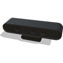

```
PROTO RobodynoCamera [
  field SFVec3f    translation  0 0 0.6
  field SFRotation rotation     -0.707 0.707 0 -3.14159
  field SFString   name         "robodyno_camera"
  field SFString   cameraId     "camera"
  field SFInt32    width        640
  field SFInt32    height       480
  field SFBool     castShadows  FALSE
  field SFString   controller   ""
]
```
- **name**: 定义相机的名称.
- **cameraId**: 定义相机的ID.
- **width**: 定义相机的像素宽度.
- **height**: 定义相机的像素高度.
- **castShadows**: 定义相机的阴影.
- **controller**: 添加相机的控制器程序.


###### CameraBracket
- Robodyno的摄像头支架.
- 源自[Solid](https://cyberbotics.com/doc/reference/solid).

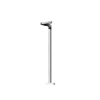

```
PROTO CameraBracket [
  field SFVec3f    translation 0 0 0.006
  field SFRotation rotation    0 0 1 0
  field SFString   name        "camera_bracket"
]
```
- **name**: 定义相机支架的名称.

##### 传动带部件
> 目录: `robodyno_webots/conveyorBelt`
###### ConveyorBelt
- Robodyno的传送带模型.
- 源自[Robot](https://cyberbotics.com/doc/reference/robot),包含一个[Track](https://cyberbotics.com/doc/reference/track).

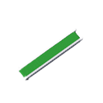

```
PROTO ConveyorBelt [
  field SFVec3f    translation 0 0 0.04
  field SFRotation rotation    1 0 0 1.57
  field SFString   name        "conveyor_belt"
  field SFString   motor_id    "0x22"
  field SFString   controller  ""
]
```
- **name**: 定义传送带的名称.
- **motor_id**: 定义传送带的ID.默认`0x22`.
- **controller**: 添加传送带的控制器程序.

##### 末端部件
> 目录: `robodyno_webots/endEffector`
  
###### RobotHand
- Robodyno的双指夹持器.
- 源自[Solid](https://cyberbotics.com/doc/reference/solid),包含两个[LinearMotor](https://cyberbotics.com/doc/reference/linearmotor).

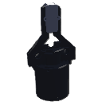

```
PROTO RobotHand [
  field SFVec3f    translation 0 0 0
  field SFRotation rotation    1 0 0 1.5708
  field SFString   name        "RobodynoGripper"
  field SFString   motor_id    "0x1A"
  field SFFloat    maxPosition 0.025
  field SFFloat    position    0
]
```
- **name**: 定义夹持器的名称.
- **motor_id**: 定义夹持器的ID.默认`0x1A`.
- **maxPosition**: 夹持器的最大允许开合位置.
- **position**: 夹持器的位置.

###### Vacuum_Gripper
- Robodyno的气动夹持器.
- 源自[Solid](https://cyberbotics.com/doc/reference/solid),包含一个[Vacuum Gripper](https://cyberbotics.com/doc/reference/vacuumgripper).

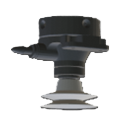

```
PROTO Vacuum_Gripper [
  field SFVec3f    translation 0 0 0
  field SFRotation rotation    0 0 1 0
  field SFString   name        "vacuum_gripper"
  field SFString   vacuum_id   "0x21"
]
```
- **name**: 定义气动的名称.
- **vacuum_id**: 定义气动的ID.默认`0x21`.

###### HBPencil
- Robodyno的HB铅笔.
- 源自[Solid](https://cyberbotics.com/doc/reference/solid).包含一个[Pen](https://cyberbotics.com/doc/reference/pen).


```
PROTO HBPencil [
  field SFVec3f    translation 0 0 0
  field SFRotation rotation 0 1 0 0
  field SFString   name "pencil"
  field SFColor    inkColor 1 0 0
  field SFFloat    inkDensity 0.5
  field SFFloat    leadSize 0.15
  field SFFloat    maxDistance 0.0
  field SFBool     write TRUE            
  field SFBool     castShadows FALSE            
]
```
- **name**: 定义铅笔的名称.
- **inkColor**: 定义铅笔的绘制颜色.
- **inkDensity**: 定义油墨颜色的浓度，范围`[0,1]`.
- **leadSize**: 定义笔尖的宽度.
- **maxDistance**: 定义铅笔与可绘画对象之间的最大距离.
- **write**: 启用铅笔书写功能.
- **castShadows**: 定义铅笔的阴影.

###### CoordinateSystem
- Robodyno的坐标系模型.
- 源自[Solid](https://cyberbotics.com/doc/reference/solid).

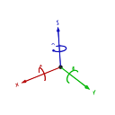

```
PROTO CoordinateSystem [
  field SFVec3f    translation 0 0 0
  field SFRotation rotation 0 0 1 1.57
  field SFString   name "coordinate"
  field SFBool     castShadows FALSE            
]
```
- **name**: 定义坐标系的名称.
- **castShadows**: 定义坐标系的阴影.

##### 关节部件
> 目录: `robodyno_webots/joints`
  
###### Pro_JP12
- ROBODYNO_PRO_01A的关节电机.
    - 减速比：12.45
    - 最大速度：310 rpm
    - 最大力矩：2.7 N⋅m
- 源自[Solid](https://cyberbotics.com/doc/reference/solid),包含一个[RotationalMotor](https://cyberbotics.com/doc/reference/rotationalmotor).

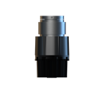

```
PROTO Pro_JP12 [
  field SFVec3f    translation 0 0 0
  field SFRotation rotation    0 0 1 0
  field SFString   motor_id    "0x10"
  field SFString{"motorFlange", "motorHousing"} outputEnd "motorFlange" 
  field SFFloat    position    0
  field MFNode     children    []
]
```
- **motor_id**: 定义关节电机的ID.默认`0x10`.
- **outputEnd**: 输出端选择(电机法兰,电机外壳).默认`电机法兰`.
- **position**: 关节电机位置.
- **children**: 添加子节点.

###### Pro_JP15
- ROBODYNO_PRO_01A的关节电机.
    - 减速比：15
    - 最大速度：246 rpm
    - 最大力矩：3.1 N⋅m
- 源自[Solid](https://cyberbotics.com/doc/reference/solid),包含一个[RotationalMotor](https://cyberbotics.com/doc/reference/rotationalmotor).


```
PROTO Pro_JP15 [
  field SFVec3f    translation 0 0 0
  field SFRotation rotation    0 0 1 0
  field SFString   motor_id    "0x10"
  field SFString{"motorFlange", "motorHousing"} outputEnd "motorFlange" 
  field SFFloat    position    0
  field MFNode     children    []
]
```
- **motor_id**: 定义关节电机的ID.默认`0x10`.
- **outputEnd**: 输出端选择(电机法兰,电机外壳).默认`电机法兰`.
- **position**: 关节电机位置.
- **children**: 添加子节点.

###### Pro_JP44
- ROBODYNO_PRO_01B的关节电机.
    - 减速比：44
    - 最大速度：85 rpm
    - 最大力矩：9 N⋅m
- 源自[Solid](https://cyberbotics.com/doc/reference/solid),包含一个[RotationalMotor](https://cyberbotics.com/doc/reference/rotationalmotor).


```
PROTO Pro_JP44 [
  field SFVec3f    translation 0 0 0
  field SFRotation rotation    0 0 1 0
  field SFString   motor_id    "0x10"
  field SFString{"motorFlange", "motorHousing"} outputEnd "motorFlange" 
  field SFFloat    position    0
  field MFNode     children    []
]
```
- **motor_id**: 定义关节电机的ID.默认`0x10`.
- **outputEnd**: 输出端选择(电机法兰,电机外壳).默认`电机法兰`.
- **position**: 关节电机位置.
- **children**: 添加子节点.

###### Pro_JP66
- ROBODYNO_PRO_01B的关节电机.
    - 减速比：66
    - 最大速度：57 rpm
    - 最大力矩：13.38 N⋅m
- 源自[Solid](https://cyberbotics.com/doc/reference/solid),包含一个[RotationalMotor](https://cyberbotics.com/doc/reference/rotationalmotor).


```
PROTO Pro_JP66 [
  field SFVec3f    translation 0 0 0
  field SFRotation rotation    0 0 1 0
  field SFString   motor_id    "0x10"
  field SFString{"motorFlange", "motorHousing"} outputEnd "motorFlange" 
  field SFFloat    position    0
  field MFNode     children    []
]
```
- **motor_id**: 定义关节电机的ID.默认`0x10`.
- **outputEnd**: 输出端选择(电机法兰,电机外壳).默认`电机法兰`.
- **position**: 关节电机位置.
- **children**: 添加子节点.

###### SliderModule
- Robodyno的直线模块.
    - 导程：10mm
    - 运动范围：0～0.25m
- 源自[Solid](https://cyberbotics.com/doc/reference/solid),包含一个[LinearMotor](https://cyberbotics.com/doc/reference/linearmotor).

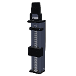

```
PROTO SliderModule [
  field SFVec3f    translation 0 0 0
  field SFRotation rotation    0 0 1 0
  field SFString   motor_id    "0x10"
  field SFFloat    initPose    0.25   
  field MFNode     children    []
]
```
- **motor_id**: 定义关节电机的ID.默认`0x10`.
- **initPose**: 直线模块的初始位置, 设置范围`[0.25,0.045]`, 单位`m`.
- **children**: 添加子节点.


##### 机械零件部件
> 目录: `robodyno_webots/objects`


##### 机器人部件
> 目录: `robodyno_webots/robots`

###### FourDofScaraRobot
- Robodyno的四自由度Scara机器人(构型一).
- 源自[Robot](https://cyberbotics.com/doc/reference/robot).

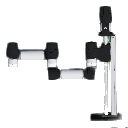

```
PROTO FourDofScaraRobot [
  field SFVec3f    translation 0 0 0
  field SFRotation rotation 0 0 1 0
  field SFString   name "FourDofScaraRobot"
  field SFString   firstJointId   "0x10"
  field SFString   secondJointId  "0x11"
  field SFString   thirdJointId   "0x12"
  field SFString   fourthJointId  "0x13"
  field SFFloat    sliderInitPose  0.25
  field SFFloat    upperarmLength  0.085
  field SFFloat    forearmLength   0.085
  field MFNode     baseChildren    []
  field MFNode     endChildren     []
  field SFString   controller       ""
]
```

- **name**: 定义机械臂的名称.
- **firstJointId**: 定义关节电机1的ID.默认`0x10`.
- **secondJointId**: 定义关节电机2的ID.默认`0x11`.
- **thirdJointId**: 定义关节电机3的ID.默认`0x12`.
- **fourthJointId**: 定义关节电机4的ID.默认`0x13`.
- **sliderInitPose**: 直线模块的初始位置.默认0.25m.
- **upperarmLength**: 大臂长度设置.默认0.085m.
- **forearmLength**: 小臂长度设置.默认0.085m.
- **baseChildren**: 添加基坐标子节点.
- **endChildren**: 添加末端坐标子节点.
- **controller**: 添加机器人控制器程序.

###### FourDofScaraRobot1
- Robodyno的四自由度Scara机器人(构型二).
- 源自[Robot](https://cyberbotics.com/doc/reference/robot).

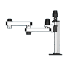

```
PROTO FourDofScaraRobot1 [
  field SFVec3f    translation 0 0 0
  field SFRotation rotation 0 0 1 0
  field SFString   name "FourDofScaraRobot1"
  field SFString   firstJointId   "0x10"
  field SFString   secondJointId  "0x11"
  field SFString   thirdJointId   "0x12"
  field SFString   fourthJointId  "0x13"
  field SFFloat    sliderInitPose  0.25
  field SFFloat    upperarmLength  0.085
  field SFFloat    forearmLength   0.085
  field MFNode     baseChildren    []
  field MFNode     endChildren     []
  field SFString   controller       ""
]
```

- **name**: 定义机械臂的名称.
- **firstJointId**: 定义关节电机1的ID.默认`0x10`.
- **secondJointId**: 定义关节电机2的ID.默认`0x11`.
- **thirdJointId**: 定义关节电机3的ID.默认`0x12`.
- **fourthJointId**: 定义关节电机4的ID.默认`0x13`.
- **sliderInitPose**: 直线模块的初始位置.默认0.25m.
- **upperarmLength**: 大臂长度设置.默认0.085m.
- **forearmLength**: 小臂长度设置.默认0.085m.
- **baseChildren**: 添加基坐标子节点.
- **endChildren**: 添加末端坐标子节点.
- **controller**: 添加机器人控制器程序.

###### FourDofScaraRobot2
- Robodyno的四自由度Scara机器人(构型三).
- 源自[Robot](https://cyberbotics.com/doc/reference/robot).

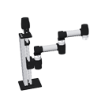

```
PROTO FourDofScaraRobot2 [
  field SFVec3f    translation 0 0 0
  field SFRotation rotation 0 0 1 0
  field SFString   name "FourDofScaraRobot2"
  field SFString firstJointId   "0x10"
  field SFString secondJointId  "0x11"
  field SFString thirdJointId   "0x12"
  field SFString fourthJointId  "0x13"
  field SFString{"PipeLink85", "PipeLink125", "PipeLink150"} upperarmType "PipeLink85" 
  field SFString{"PipeLink85", "PipeLink125", "PipeLink150"} forearmType "PipeLink85" 
  field MFNode   baseChildren    []
  field MFNode   endChildren     []
  field SFString controller       ""
]
```

- **name**: 定义机械臂的名称.
- **firstJointId**: 定义关节电机1的ID.默认`0x10`.
- **secondJointId**: 定义关节电机2的ID.默认`0x11`.
- **thirdJointId**: 定义关节电机3的ID.默认`0x12`.
- **fourthJointId**: 定义关节电机4的ID.默认`0x13`.
- **upperarmType**: 大臂长度选择.默认`85mm`.
- **forearmType**: 小臂长度选择.默认`85mm`.
- **baseChildren**: 添加基坐标子节点.
- **endChildren**: 添加末端坐标子节点.
- **controller**: 添加机器人控制器程序.

###### SixDofCollaborationRobot
- Robodyno的六自由度机器人.
- 源自[Robot](https://cyberbotics.com/doc/reference/robot).

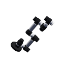

```
PROTO SixDofCollaborationRobot [
  field SFVec3f translation 0 0 0
  field SFRotation rotation 1 0 0 0
  field SFString name "SixDofCollaborationRobot"
  field SFString firstJointId   "0x10"
  field SFString secondJointId  "0x11"
  field SFString thirdJointId   "0x12"
  field SFString fourthJointId  "0x13"
  field SFString fifthJointId   "0x14"
  field SFString sixthJointId   "0x15"
  field SFFloat  upperarmLength  0.085
  field SFFloat  forearmLength   0.085
  field MFNode   baseChildren    []
  field MFNode   endChildren     []
  field SFString controller     ""
]
```

- **name**: 定义机械臂的名称.
- **firstJointId**: 定义关节电机1的ID.默认`0x10`.
- **secondJointId**: 定义关节电机2的ID.默认`0x11`.
- **thirdJointId**: 定义关节电机3的ID.默认`0x12`.
- **fourthJointId**: 定义关节电机4的ID.默认`0x13`.
- **fifthJointId**: 定义关节电机5的ID.默认`0x14`.
- **sixthJointId**: 定义关节电机6的ID.默认`0x15`.
- **upperarmLength**: 大臂长度.默认`0.085m`.
- **forearmLength**: 小臂长度.默认`0.085m`.
- **baseChildren**: 添加基坐标子节点.
- **endChildren**: 添加末端坐标子节点.
- **controller**: 添加机器人控制器程序.

###### ThreeDofCartesianRobot
- Robodyno的三自由度笛卡尔机器人.
- 源自[Robot](https://cyberbotics.com/doc/reference/robot).

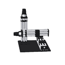

```
PROTO ThreeDofCartesianRobot [
  field SFVec3f translation 0 0 0
  field SFRotation rotation 0 0 1 0
  field SFString name "ThreeDofCartesianRobot"
  field SFString firstJointId   "0x10"
  field SFString secondJointId  "0x11"
  field SFString thirdJointId   "0x12"
  field SFFloat  xAxisinitPose  0.18
  field SFFloat  yAxisinitPose  0.10
  field SFFloat  zAxisinitPose  0.25
  field MFNode   baseChildren   []
  field MFNode   xAxisChildren  []
  field MFNode   yAxisChildren  []
  field SFString controller     ""
]
```

- **name**: 定义机械臂的名称.
- **firstJointId**: 定义关节电机1的ID.默认`0x10`.
- **secondJointId**: 定义关节电机2的ID.默认`0x11`.
- **thirdJointId**: 定义关节电机3的ID.默认`0x12`.
- **xAxisinitPose**: x轴初始位置, 设置范围`[0.25,0.045]`, 单位`m`.
- **yAxisinitPose**: y轴初始位置, 设置范围`[0.25,0.045]`, 单位`m`.
- **zAxisinitPose**: z轴初始位置, 设置范围`[0.25,0.045]`, 单位`m`.
- **baseChildren**: 添加基坐标子节点.
- **xAxisChildren**: 添加X坐标子节点.
- **yAxisChildren**: 添加Y坐标子节点.
- **controller**: 添加机器人控制器程序.

###### ThreeDofDeltaRobot
- Robodyno的三自由度Delta机器人.
- 源自[Robot](https://cyberbotics.com/doc/reference/robot).

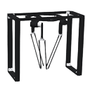

```
PROTO ThreeDofDeltaRobot [
  field SFVec3f    translation   0 0 0
  field SFRotation rotation      0 0 1 0
  field SFString   name          "ThreeDofDeltaRobot"
  field SFString   firstJointId  "0x10"
  field SFString   secondJointId "0x11"
  field SFString   thirdJointId  "0x12"
  field MFNode     baseChildren  []
  field MFNode     endChildren   []
  field SFString   controller    ""
]
```

- **name**: 定义机械臂的名称.
- **firstJointId**: 定义关节电机1的ID.默认`0x10`.
- **secondJointId**: 定义关节电机2的ID.默认`0x11`.
- **thirdJointId**: 定义关节电机3的ID.默认`0x12`.
- **baseChildren**: 添加基坐标子节点.
- **endChildren**: 添加末端坐标子节点.
- **controller**: 添加机器人控制器程序.

##### 其它部件
> 目录: `robodyno_webots/others`

###### CustomBox
- Robodyno的一个自定义六面材质的盒子.
- 源自[Solid](https://cyberbotics.com/doc/reference/solid).


```
PROTO CustomBox [
  field SFVec3f    translation 0 0 0
  field SFRotation rotation    0 0 1 0
  field SFString   name        "custom box"
  field SFVec3f    size        0.05 0.05 0.05      
  field SFFloat    mass        0.25                
  field SFBool     locked      FALSE            
  field SFBool     castShadows TRUE            
  field SFFloat    lidAngle    0                
  field SFNode     topAppearance      PBRAppearance { baseColor 1 0 0 roughness 1 metalness 0}
  field SFNode     bottomAppearance   PBRAppearance { baseColor 1 0 0 roughness 1 metalness 0}
  field SFNode     leftAppearance     PBRAppearance { baseColor 1 0 0 roughness 1 metalness 0}
  field SFNode     rightAppearance    PBRAppearance { baseColor 1 0 0 roughness 1 metalness 0}
  field SFNode     frontAppearance    PBRAppearance { baseColor 1 0 0 roughness 1 metalness 0}
  field SFNode     backAppearance     PBRAppearance { baseColor 1 0 0 roughness 1 metalness 0}
]
```

- **name**: 定义盒子的名称.
- **size**: 定义盒子的大小.
- **mass**: 定义盒子的质量.
- **locked**: 定义盒子的坐标固定.
- **castShadows**: 定义盒子的阴影.
- **lidAngle**: 定义盒子的开合角度.
- **topAppearance**: 定义盒子的上表面材质,默认`红色`.
- **bottomAppearance**: 定义盒子的下表面材质,默认`红色`.
- **leftAppearance**: 定义盒子的左表面材质,默认`红色`.
- **rightAppearance**: 定义盒子的右表面材质,默认`红色`.
- **frontAppearance**: 定义盒子的前表面材质,默认`红色`.
- **backAppearance**: 定义盒子的后表面材质,默认`红色`.

###### CustomStorageBox
- Robodyno的一个自定义物料盒.
- 源自[Solid](https://cyberbotics.com/doc/reference/solid).


```
PROTO CustomStorageBox [
  field SFVec3f    translation 0 0 0
  field SFRotation rotation    1 0 0 0
  field SFString   name        "custom storage box"
  field SFColor    color       0.2 0.2 0.2
  field SFString{"1", "2", "4", "6"}   box_number "4"
  field SFBool     castShadows FALSE            
  field SFNode     firstAppearance    PBRAppearance { baseColor 0.2 0.2 0.2 roughness 1 metalness 0}
  field SFNode     secondAppearance   PBRAppearance { baseColor 0.2 0.2 0.2 roughness 1 metalness 0}
  field SFNode     thirdAppearance    PBRAppearance { baseColor 0.2 0.2 0.2 roughness 1 metalness 0}
  field SFNode     fourthAppearance   PBRAppearance { baseColor 0.2 0.2 0.2 roughness 1 metalness 0}
  field SFNode     fifthAppearance    PBRAppearance { baseColor 0.2 0.2 0.2 roughness 1 metalness 0}
  field SFNode     sixthAppearance    PBRAppearance { baseColor 0.2 0.2 0.2 roughness 1 metalness 0}
]
```

- **name**: 定义物料盒的名称.
- **color**: 定义物料盒的颜色.
- **box_number**: 选择物料盒的数量，默认`4`.
- **castShadows**: 设置物料盒的阴影.
- **firstAppearance**: 定义第1个物料盒的底面材质, 默认`黑色`.
- **secondAppearance**: 定义第2个物料盒的底面材质, 默认`黑色`.
- **thirdAppearance**: 定义第3个物料盒的底面材质, 默认`黑色`.
- **fourthAppearance**: 定义第4个物料盒的底面材质, 默认`黑色`.
- **fifthAppearance**: 定义第5个物料盒的底面材质, 默认`黑色`.
- **sixthAppearance**: 定义第6个物料盒的底面材质, 默认`黑色`.

###### DrawingBoard
- Robodyno的一个绘图板.
- 源自[Solid](https://cyberbotics.com/doc/reference/solid).


```
PROTO DrawingBoard [
  field SFVec3f    translation 0 0 0.012
  field SFRotation rotation    0 0 1 0
  field SFString   name        "drawing board"
  field SFColor    color       0.267 0.8 0.26
  field SFBool     locked      FALSE
  field SFBool     castShadows FALSE
]
```

- **name**: 定义绘图板的名称.
- **color**: 定义绘图板的颜色, 默认`绿色`.
- **locked**: 定义绘图板的锁定.
- **castShadows**: 定义绘图板的阴影.

### 示例

所有的示例存放在 `机械臂` 目录下，可以通过 Webots 的 `File -> Open World` 菜单打开。示例中包含了一些典型的机械臂模型，每个模型都绑定了一个简单的控制器，可以通过指定关节的目标位置来控制机械臂的运动。控制器的源代码存放在 `controllers` 目录下。
